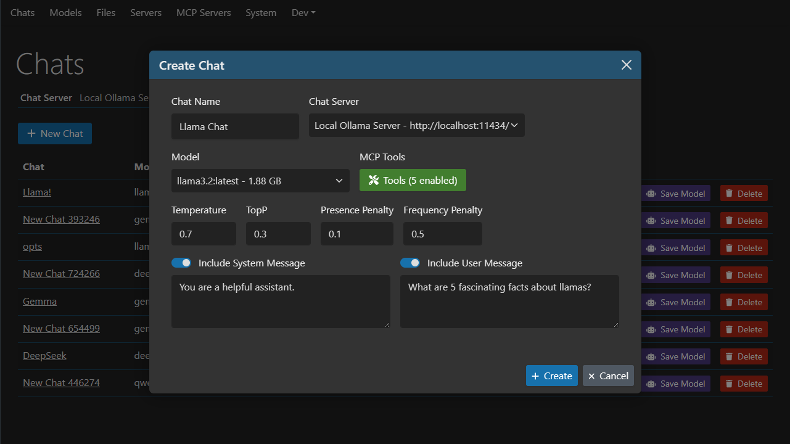
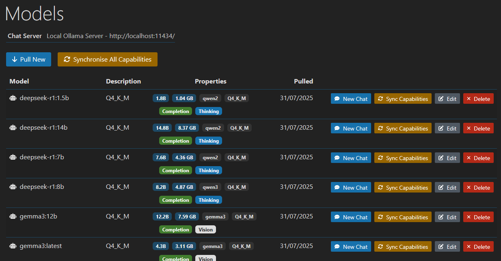
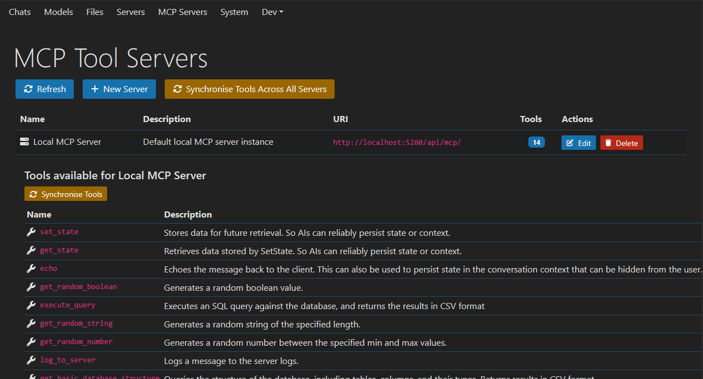

# OllamaFarmer

[](https://github.com/Merp4/OllamaFarmer/actions/workflows/docker-release-amd64.yml)
&nbsp;&nbsp;&nbsp;
[](https://github.com/Merp4/OllamaFarmer/actions/workflows/docker-ci-amd64.yml)

A full-stack application for managing and interacting with Ollama AI models, featuring a React TypeScript frontend and ASP.NET Core backend with Entity Framework and Model Context Protocol (MCP) integration.

This project is in its infancy, breaking changes with updates are to be expected. It is primarily designed for personal use and learning purposes.
That said, breaking changes are to be kept to a minimum.

## Quick Start with Docker

```bash
# Pull the latest image
docker pull merrrp/ollama-farmer:latest

# Run OllamaFarmer with external MySQL and Ollama
docker run -d \
  --name ollama-farmer \
  -p 8080:8080 \
  -p 8081:8081 \
  -e ConnectionStrings__MySql="server=host.docker.internal;uid=root;pwd=your-password;database=ollamafarmer" \
  -e DefaultChatServer__Uri="http://host.docker.internal:11434" \
  merrrp/ollama-farmer:latest
```

## 🚀 Features

- **Chat Management**: Create, manage, and interact with AI chat sessions
- **Model Support**: Full integration with Ollama models and capabilities
- **Tool Integration**: Model Context Protocol (MCP) tools for enhanced AI interactions
- **Multi-Server Support**: Connect to multiple Ollama instances via chatServerId
- **Real-time Updates**: SignalR integration
- **File Management**: Upload and manage images and files for AI interactions
- **Modern UI**: React TypeScript frontend with Vite build system

## Screenshots

### Image/file support

[Image by @jossiahfarrow](https://www.pexels.com/@josiahfarrow/)


### Chat management



### Model management



### MCP tools





> `Tool call get_random_number completed successfully.`

## 🏗️ Architecture

### Backend (OllamaFarmer.Server)

- **ASP.NET Core 9** with modern minimal APIs
- **Entity Framework Core** with MySQL/MariaDB support
- **Microsoft.Extensions.AI** for standardized AI integrations
- **Model Context Protocol (MCP)** for tool integrations
- **SignalR** for real-time communication
- **OpenAPI/Swagger** for API documentation

### Frontend (ollamafarmer.client)

- **React 18** with TypeScript
- **Vite** for fast development and building
- **OpenAPI Code Generation** for type-safe API client
- **Modern React patterns** with hooks and context

## 🐳 Docker Deployment

OllamaFarmer is available as a ready-to-use Docker container at `merrrp/ollama-farmer` on DockerHub.

```bash
# Pull the latest image
docker pull merrrp/ollama-farmer:latest
```

### Quick Start with Docker

```bash
# Run OllamaFarmer with external MySQL and Ollama
docker run -d \
  --name ollama-farmer \
  -p 8080:8080 \
  -p 8081:8081 \
  -e ConnectionStrings__MySql="server=host.docker.internal;uid=root;pwd=your-password;database=ollamafarmer" \
  -e DefaultChatServer__Uri="http://host.docker.internal:11434" \
  merrrp/ollama-farmer:latest
```

### Docker Compose

```yaml
version: '3.8'
services:
  ollama-farmer:
    image: merrrp/ollama-farmer:latest
    ports:
      - "8080:8080"
      - "8081:8081"
    environment:
      - ConnectionStrings__MySql=server=mysql;uid=root;pwd=your-password;database=ollamafarmer
      - DefaultChatServer__Uri=http://ollama:11434
    depends_on: [mysql, ollama]
  # ... mysql and ollama services
```

📖 **For complete Docker setup instructions, configuration options, and examples, see [Docker Usage Guide](docs/docker-usage.md)**

## 📦 Local Development Setup

### Prerequisites

- Docker (for Ollama and database)
- .NET 9 SDK
- Node.js 18+ and npm

### 1. Ollama Setup

Official DockerHub: [ollama/ollama](https://hub.docker.com/r/ollama/ollama)

```bash
# Pull latest Ollama image
docker pull ollama/ollama:latest

# Run Ollama (CPU version)
docker run -d -v $env:APPDATA\ollama-docker:/root/.ollama -p 11434:11434 --name ollama ollama/ollama:latest

# Install models
docker exec -it ollama ollama run llama3
```

[Browse available models](https://ollama.com/library)

### 2. Database Setup

#### MySQL (Recommended)

```bash
docker run --name ollamafarmer-mysql \
  -v $env:APPDATA\ollamafarmer\mysql:/var/lib/mysql \
  -e MYSQL_ROOT_PASSWORD=ollama-expo-mysql \
  -e MYSQL_DATABASE=ollamafarmer \
  -p 3306:3306 -d mysql:latest
```

#### MariaDB (Alternative)

```bash
docker run --name ollamafarmer-mariadb \
  -v $env:APPDATA\ollamafarmer\mariadb:/var/lib/mysql:Z \
  -e MARIADB_ROOT_PASSWORD=ollama-expo-mysql \
  -e MARIADB_DATABASE=ollamafarmer \
  -p 3306:3306 -d mariadb:latest
```

### 3. Backend Setup

```bash
cd OllamaFarmer.Server

# Restore packages
dotnet restore

# Configure connection string in appsettings.Development.json
# Default: "server=127.0.0.1;uid=root;pwd=ollama-expo-mysql;database=ollamafarmer"

# Run database migrations
dotnet ef database update

# Start the server
dotnet run
```

### 4. Frontend Setup

```bash
cd ollamafarmer.client

# Install dependencies
npm install

# Start development server
npm run dev
```

## 🔧 Development

### API Schema Updates

The project uses OpenAPI code generation for type-safe frontend API clients:

```bash
# Regenerate API types after backend changes
cd ollamafarmer.client
npm run build-api
```

### Database Migrations

```bash
cd OllamaFarmer.Server

# Create new migration
dotnet ef migrations add MigrationName

# Apply migrations
dotnet ef database update

# View migration status
dotnet ef migrations list
```

### Key Configuration Files

- `OllamaFarmer.Server/appsettings.Development.json` - Backend configuration
- `ollamafarmer.client/vite.config.ts` - Frontend build configuration
- `OllamaFarmer.Server/Data/AppDbContextFactory.cs` - EF design-time factory

## 🛠️ Troubleshooting

### Common Issues

1. **Migration Errors**: Use the `AppDbContextFactory` for design-time operations
2. **API Type Mismatches**: Regenerate API types with `npm run build-api`
3. **Database Connection**: Verify MySQL/MariaDB container is running
4. **Ollama Connection**: Ensure Ollama is accessible on port 11434

### Build Verification

```bash
# Backend build
cd OllamaFarmer.Server && dotnet build

# Frontend build
cd ollamafarmer.client && npm run build
```
